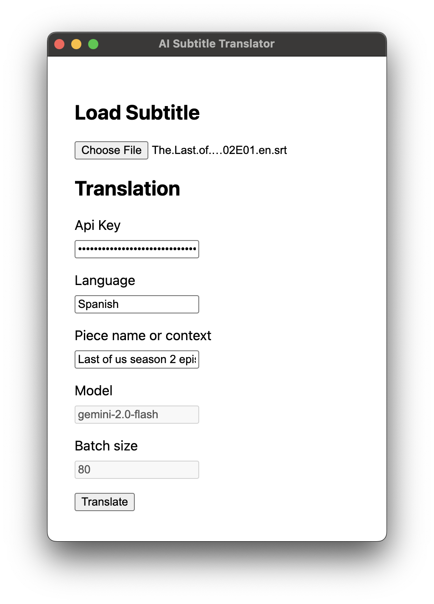

# AI Subtitle Translator



An Electron-based desktop application for translating subtitles using AI technology. This application allows users to translate subtitle files efficiently using Google's Generative AI.

## Features

- Upload and process subtitle files
- AI-powered translation using Google's Generative AI
- Batch translation capabilities
- Secure storage of API keys
- Modern React-based user interface

## Usage


1. Grab latest release or build the app
2. Obtain API key for Gemini AI [here](https://aistudio.google.com/app/apikey)
3. Launch the app
4. Load source .srt file 
5. Enter your API key, language to translate, name the piece of content that you want to translate (eg. Last of us season 2 episode 1)
6. Press Translate button. It should take couple of minutes (progress will be displayed)

## Prerequisites

- Node.js (v14 or higher)
- npm (v6 or higher)


## Installation

1. Clone the repository:
```bash
git clone https://github.com/seeingred/ai-sub-translator.git
cd ai-sub-translator
```

2. Install dependencies:
```bash
npm install
```


## Development

To start the application in development mode:

```bash
npm start
```

## Building

To create a production build:

```bash
npm run make
```

This will create distributable packages for your platform.

## Available Scripts

- `npm start` - Start the application in development mode
- `npm run make` - Create distributable packages

## Project Structure

```
ai-sub-translator/
├── src/
│   ├── components/     # React components
│   ├── index.ts        # Main process entry point
│   ├── renderer.ts     # Renderer process entry point
│   ├── handleSubtitle.ts # Subtitle processing logic
│   ├── translateBatch.tsx # Batch translation functionality
│   └── types.ts        # TypeScript type definitions
├── .webpack/           # Webpack build output
├── out/                # Production build output
└── package.json        # Project configuration and dependencies
```

## Technologies Used

- Electron
- React
- TypeScript
- Webpack
- Google Generative AI API

## License

This project is licensed under the MIT License - see the LICENSE file for details.

## Author

Alex